# 🛡️ Notification Keeper

<div align="center">


**A modern, privacy-first notification management, OTP extraction, and analytics vault for Android.**  
*Built with Flutter, Kotlin, Room DB, and Material 3 Glassmorphism.*

[](LICENSE)
[](https://dart.dev)
[](https://kotlinlang.org)
[](https://developer.android.com/training/data-storage/room)
[](#-security--privacy-first-architecture)
[](#-multi-language-support)
[](https://github.com/berkelmali/NotificationKeeper/pulls)

[Features](#-key-features) • [Architecture](#-system-architecture) • [Getting Started](#-getting-started) • [Security](#-security--privacy-first-architecture) • [Project Structure](#-project-structure) • [License](#-license)

</div>

---

## 📌 Overview

**Notification Keeper** is an all-in-one notification history, security vault, and analytics application for Android. It seamlessly intercepts and organizes incoming system notifications in the background—ensuring you **never miss an important message, deleted chat, OTP verification code, or time-sensitive alert again**.

Everything runs **100% locally on your device**. No external servers, no tracking, no ads, and no telemetry.

Two things set it apart from a plain notification log: the **[Recall Radar](#-12-recall-radar--catch-deleted-messages)** flags messages whose sender tried to unsend them, and the **[Code Shredder](#-13-code-shredder--ephemeral-verification-codes)** destroys captured verification codes once they expire, so yesterday's archive stops being today's liability.

---

## ✨ Key Features

### 🔔 1. Intelligent Background Interception
- **Native Android Listener**: Hooks directly into Android's `NotificationListenerService` for lightweight, zero-latency background logging without draining battery.
- **Ready From Day One**: Right after access is granted, a one-time picker asks which apps to keep, with chat apps and the phone's default SMS app (whatever its brand) already ticked — so the archive is not empty until someone finds the Apps tab.
- **Smart Chat Parser**: Accurately extracts real senders and content from messaging apps (e.g., WhatsApp, Telegram, Signal), filtering out noisy group-summary updates and ongoing system tasks.
- **Image Attachment Caching**: Automatically saves `BigPictureStyle` notification media (e.g. photos received in messages) to protected app-internal storage with an in-app zoomable viewer.

### 🔢 2. Smart OTP & Verification Code Radar
- **Instant Code Detection**: Finds the 4–8 digit one-time code by its distance to a code word — in English and Turkish (also typed without Turkish letters), plus a few other languages — and ignores what only looks like one: the sender's phone number, call-centre numbers, amounts of money, times, dates and years.
- **Recent Codes Ribbon**: Displays captured codes at the top of the archive for 1-tap clipboard copying.
- **Auto-Masking Privacy**: Masked previews hide sensitive codes after copying to protect your privacy from shoulder surfers.

### 📡 3. Keyword Radar & Instant Alerts
- **Priority Keyword Engine**: Define custom keywords (e.g., `urgent`, `bank`, `security`, `code`, `transfer`).
- **Instant Local Alerts**: Receive prioritized heads-up notifications whenever high-priority keywords or OTP codes are intercepted.

### 🔐 4. Security Vault
- **A PIN of Its Own**: Turning the vault on starts with creating a 4–8 digit PIN — the vault's own registration. Only a salted PBKDF2-HMAC-SHA256 hash is stored, and five wrong tries start an escalating lockout (30 seconds up to an hour) that survives a restart.
- **Fingerprint Unlock, Any Number of Fingers**: Every fingerprint saved in Android opens the vault, and *Add or manage fingerprints* goes straight to Android's own fingerprint list — apps cannot enrol fingers themselves. Unlocking runs through an Android Keystore key that Android destroys when another biometric is enrolled, so a finger added later is refused until the PIN has been entered. Weak (class 2) face unlock never opens it.
- **Covers Everything**: The lock sits above the app's navigator, so a photo left open in the viewer or an open sheet stays hidden, and unlocking returns to the same screen. While the vault is on, the app switcher shows a blank card instead of the archive (Android 13+).
- **Forgot PIN**: The phone's screen lock confirms it is you, then you choose a new PIN — which makes the vault as strong as that screen lock, and Settings says so.
- **Auto Re-Lock**: The vault re-locks itself after the app has been in the background for 30 seconds — it is not a once-per-boot prompt. Short enough to be a real lock, long enough that hopping to another app to type a captured code does not demand a fingerprint on the way back.
- **Configurable Protection**: Toggle security on/off directly from Settings.

### 📊 5. Comprehensive Analytics & Heatmap
- **Activity Heatmap**: 24-hour visual intensity grid illustrating peak notification traffic.
- **Weekly Trends & Charts**: Interactive bar charts powered by `fl_chart`.
- **Key Metrics**: Real-time counters for Total, Today, Weekly, Unread, OTP Codes, Priority Alerts, and Quiet Hours filters.
- **App Breakdown**: View and rank which apps generate the most notifications.

### 🔍 6. Advanced Search, Filters & Organization
- **Full-Text Search**: Instant search across titles, message content, senders, and tags.
- **Date Range Picker**: Filter logs between specific start and end calendar dates.
- **Multi-Tag System**: Add custom color-coded tags (`Important`, `Work`, `Personal`, `Finance`, `Social`, etc.).
- **Starred Items**: Star critical notifications for quick bookmark access.
- **Chronological Grouping**: Clean grouping by Today, Yesterday, This Week, This Month, and Older.

### ⏳ 7. Granular App Controls & Quiet Hours
- **Per-App Monitoring**: Selectively enable or disable notification recording for specific apps.
- **Per-App Temporary Snooze**: Snooze logging for specific noisy apps for 1 hour, 8 hours, or 24 hours.
- **Quiet Hours (Do Not Disturb)**: Schedule quiet windows where notifications keep being archived but no instant alert popup is raised. Nothing is dropped — the dashboard shows how many were captured quietly.

### 🧹 8. Automated Data Hygiene & Retention
- **WorkManager Auto-Cleanup**: Set automated background retention policies (Keep Forever, 3, 7, 30, or 90 days).
- **Orphan File Cleanup**: Automatically purges obsolete image attachments when older notification records expire.

### 💾 9. Backup, Restore & Export
- **Encrypted Round-Trip Backups**: Export your entire archive, settings, and keyword radar to a portable `.nkbackup` file.
- **AES-256-CBC Encryption**: Optional passphrase protection, with the key stretched through PBKDF2-HMAC-SHA256 over a per-file random salt.
- **Data Export**: Export notification records to **CSV** or **JSON** for external audits or spreadsheets.

### 📱 10. Native Home Screen Widget
- **Launcher Widget**: Native Android AppWidget (`NotificationWidgetProvider`) displaying the 4 most recent notifications right on your home screen with real-time updates.

### 🌐 11. Multi-Language Support & Glassmorphic UI
- **Languages**: Full localization for English (`en`) and Turkish (`tr`), covering the Flutter UI as well as the alerts the native listener posts.
- **Modern Design**: Ultra-sleek dark and light themes, subtle gradients, Glassmorphic cards, Shimmer loaders, and edge-to-edge layout.

### ↩️ 12. Recall Radar — Catch Deleted Messages
- **Withdrawal Detection**: Android tells a listener *why* a notification disappeared. When the posting app pulls one back within seconds of sending it — exactly what a messaging app does the moment a sender deletes ("unsends") a message — the archived copy is flagged as **Recalled**.
- **Your Copy Survives**: The message text was already saved; only the fact that someone tried to take it back is new information.
- **Dedicated Filter & Alert**: A `↩️ Recalled` chip appears in the archive as soon as something is withdrawn, a dashboard counter tracks it, and an optional instant alert tells you the moment it happens.
- **Honest by Design**: Apps also cancel their own notifications innocently, so this is a strong signal, not proof. The detector requires a near-instant withdrawal *and* a conversation-style notification, and the UI says "the message **may** have been deleted" rather than asserting it.

### 🔥 13. Code Shredder — Ephemeral Verification Codes
- **Self-Destructing OTPs**: A one-time code is useless a minute after it arrives but stays dangerous forever. Choose a shred window (5 minutes, 15 minutes, 1 hour, 1 day, or off) and expired codes destroy themselves.
- **Real Destruction, Not Masking**: The digits are `UPDATE`d out of the database row — `extractedCode` is nulled and every 4-8 digit run in the title and body is replaced with bullets. They are gone from the archive, from CSV/JSON exports, and from any backup taken afterwards.
- **History Survives**: The notification row is kept, so the archive still records *that* a code arrived from an app at a given time. Only the secret is destroyed.
- **Runs While Closed**: A WorkManager job shreds on a schedule; the app also runs a pass on launch and on every archive refresh, so nothing expired is ever drawn on screen.
- **Off by Default**: Destroying data is never turned on behind a user's back.

---

## 🏗️ System Architecture

```mermaid
flowchart TD
    subgraph Android Native [Android Native Layer - Kotlin]
        NLS[NotificationListenerService] -->|Intercepts System StatusBar| NLS
        NLS -->|OTP & Keyword Parser| NLS
        NLS -->|Recall Radar: flags withdrawn messages| ROOM
        NLS -->|Cache Images| FS[(Internal Storage)]
        NLS -->|Persist Records| ROOM[(Room DB SQLite v7)]
        
        WM[WorkManager RetentionWorker] -->|Daily Auto-Clean| ROOM
        WM -->|Delete Expired Media| FS

        CS[WorkManager CodeShredWorker] -->|Destroy Expired OTP Digits| ROOM
        
        WIDGET[AppWidgetProvider] <-->|Display Recent 4| ROOM
        
        MC[MethodChannel Bridge] <-->|CRUD & Preferences| ROOM
    end

    subgraph Flutter Layer [Flutter Presentation Layer - Dart]
        MC <--> REPO[NotificationRepository]
        REPO <--> BACKUP[BackupService: AES-256 / JSON]
        
        REPO --> NP[NotificationProvider]
        REPO --> AP[AppListProvider]
        REPO --> SP[SettingsProvider]
        REPO --> STP[StatsProvider]
        
        GUARD{Vault} -->|Unlocked| UI[Material 3 Glassmorphic UI]
        GUARD -->|Locked| LOCK[VaultLockScreen: PIN + fingerprint]
        
        UI --> DASH[Dashboard Screen]
        UI --> ARCH[Archive & Search Screen]
        UI --> APPS[Apps Management Screen]
        UI --> SETT[Settings & Security Screen]
    end
```



---

## 🛠️ Technology Stack

| Layer | Technologies / Packages |
|---|---|
| **Framework** | [Flutter](https://flutter.dev) (Dart SDK `^3.10.7`) |
| **Native Android** | Kotlin, Android SDK 34, `NotificationListenerService`, `AppWidgetProvider` |
| **Local Database** | Native Android **Room ORM** (v7 schema migration pipeline) |
| **Background Tasks** | Android Jetpack **WorkManager** (`androidx.work:work-runtime-ktx`) |
| **State Management** | [Provider](https://pub.dev/packages/provider) (`^6.1.5`) |
| **Security & Auth** | [local_auth](https://pub.dev/packages/local_auth), [encrypt](https://pub.dev/packages/encrypt) (AES-256), [pointycastle](https://pub.dev/packages/pointycastle) (PBKDF2-HMAC-SHA256), [crypto](https://pub.dev/packages/crypto) (SHA-256) |
| **Charts & Visuals** | [fl_chart](https://pub.dev/packages/fl_chart), [shimmer](https://pub.dev/packages/shimmer), [google_fonts](https://pub.dev/packages/google_fonts) |
| **Localization** | `flutter_localizations`, ARB generation (`app_en.arb`, `app_tr.arb`) |
| **File I/O & Sharing** | [file_picker](https://pub.dev/packages/file_picker), [share_plus](https://pub.dev/packages/share_plus), [path_provider](https://pub.dev/packages/path_provider) |

---

## 🔒 Security & Privacy-First Architecture

1. **Zero Cloud Dependencies**: The app operates completely offline. No tracking SDKs, no analytics endpoints, no third-party ads.
2. **Encrypted Backups**: Backup files (`.nkbackup`) can be encrypted with AES-256-CBC under a key derived with **PBKDF2-HMAC-SHA256 (120,000 iterations, random 16-byte salt)**, plus a randomly generated IV per backup. The salt and iteration count travel in the file, so the cost can be raised later without stranding existing backups — and files written by older versions (unsalted SHA-256) still restore.
3. **Vault**: A PIN of its own (salted PBKDF2-HMAC-SHA256, persisted attempt limit), with fingerprint unlock through `BiometricPrompt` and a `CryptoObject` over an Android Keystore key that is invalidated whenever a biometric is enrolled — only the fingers that were on the phone when fingerprint unlock was switched on can open it until the PIN is entered again. Re-locks after 30 seconds in the background.
4. **Sandboxed Media**: Cached notification images are stored in `context.filesDir/notification_images/`—isolated from the public gallery and invisible to other apps.
5. **Ephemeral Secrets**: With the [Code Shredder](#-13-code-shredder--ephemeral-verification-codes) enabled, captured verification codes are destroyed in place once they expire, so an old archive stops being a liability.

### Known limits, stated plainly
- **Recall Radar is a heuristic** (see feature 12) — a strong signal that a message was withdrawn, not a guarantee.
- The vault is an **access lock**: the archive sits in the app's private storage and is not separately encrypted, and *Forgot PIN* trusts the phone's screen lock.
- Encrypted backups are **not authenticated** (no HMAC/AEAD). A wrong passphrase is caught by padding and JSON validation rather than by a MAC, and a tampered file is detected only if it fails to parse.
- The **Kotlin layer is mostly untested**: only the code extractor has JVM unit tests. The listener, the workers and the Room migrations are covered by manual device testing only.

---

## 🚀 Getting Started

### Prerequisites
- [Flutter SDK](https://docs.flutter.dev/get-started/install) — any version whose bundled **Dart SDK satisfies `^3.10.7`** (see `pubspec.yaml`). Check yours with `flutter --version`.
- [Android Studio](https://developer.android.com/studio) / Android SDK (API Level 21+ / Target SDK 34)
- Java Development Kit (JDK 17 recommended)

### Installation & Run

1. **Clone the repository:**
   ```bash
   git clone https://github.com/berkelmali/NotificationKeeper.git
   cd NotificationKeeper
   ```

2. **Install Flutter dependencies:**
   ```bash
   flutter pub get
   ```

3. **Generate Localization files (if needed):**
   ```bash
   flutter gen-l10n
   ```

4. **Connect an Android device or emulator and run:**
   ```bash
   flutter run
   ```

5. **Build Release APK:**
   ```bash
   flutter build apk --release
   ```

### ⚙️ Granting Notification Access
Upon first launch:
1. Tap **Enable Permission** on the welcome screen.
2. Android will open the **Device & App Notifications** settings screen.
3. Find **Notification Keeper** in the list and toggle the switch **ON**.
4. Return to the app and start tracking your notifications!

---

## 📁 Project Structure

```
NotificationKeeper/
├── android/
│   └── app/src/main/
│       ├── AndroidManifest.xml
│       ├── kotlin/com/example/notification_keeper/
│       │   ├── app/MainActivity.kt                # Platform MethodChannel handler
│       │   ├── data/
│       │   │   ├── database/AppDatabase.kt         # Room DB instance & migration v1-v7
│       │   │   ├── dao/NotificationDao.kt          # SQLite Data Access Object
│       │   │   └── entity/NotificationEntity.kt    # Notification & Preference entities
│       │   ├── service/NotificationListener.kt     # Interceptor + Recall Radar
│       │   ├── widget/NotificationWidgetProvider.kt# Android Home Screen Widget
│       │   ├── worker/RetentionWorker.kt           # WorkManager daily cleanup job
│       │   └── worker/CodeShredWorker.kt           # WorkManager OTP shredder
│       └── res/                                    # Widget layouts, icons & XML strings
├── lib/
│   ├── data/
│   │   ├── repositories/notification_repository.dart# MethodChannel communication bridge
│   │   └── services/backup_service.dart            # AES-256 backup & restore logic
│   ├── domain/
│   │   └── models/                                 # Notification, AppInfo & Stats models
│   ├── l10n/
│   │   ├── app_en.arb                              # English localization template
│   │   ├── app_tr.arb                              # Turkish localization
│   │   └── generated/                              # flutter gen-l10n output (checked in)
│   ├── presentation/
│   │   ├── providers/                              # State management (Provider)
│   │   ├── screens/                                # UI Screens (Dashboard, Archive, Settings, etc.)
│   │   ├── theme/                                  # AppTheme & AppColors design tokens
│   │   └── widgets/                                # GlassCard, Heatmap, OTP Ribbon, etc.
│   └── main.dart                                   # App entrypoint & theme initialization
├── test/                                           # Automated unit and widget tests
├── pubspec.yaml                                    # Dependencies & asset declarations
├── LICENSE                                         # MIT License
└── README.md                                       # Project documentation
```

---

## 🧪 Testing

Run all unit and widget tests with:

```bash
flutter test
```

Test suite includes:
- **`notification_model_test.dart`**: Model deserialization, copyWith, tags, OTP flags, plus the Recall Radar / Code Shredder columns (including rows written before the v7 migration).
- **`notification_provider_test.dart`**: Archive filtering, the `recalled` filter mode, and the guarantee that the shred pass runs *before* the archive is read — and never blocks it if it fails.
- **`backup_service_test.dart`**: AES-256 round-trip, per-backup random salt and IV, restoring legacy (pre-PBKDF2) backups, invalid passphrase rejection, corruption handling.
- **`settings_provider_test.dart`**: SharedPreferences persistence for retention days, keyword radar, biometric flags, and the code-shred window.
- **`app_info_model_test.dart`** / **`stats_model_test.dart`**: App preferences, snooze state, and dashboard aggregates.
- **`vault_service_test.dart`**: PIN format, salted hashing (the PIN itself is never stored), the attempt limit and escalating lockout, and that a restart does not reset it.
- **`vault_provider_test.dart`**: Fingerprint unlock only ever on top of a PIN, how an unlock attempt ended, and the round trip to Android's fingerprint settings.
- **`vault_lock_screen_test.dart`**: Re-lock timing, and the lock covering any screen left open on top — unlocking returns to it.
- **`pin_pad_test.dart`**: The keypad, length limits, the wrong-PIN reset, and the lockout countdown format.
- **`recent_codes_widget_test.dart`**: OTP filtering, copy-to-clipboard actions, and auto-masking timer.
- **`app_picker_screen_test.dart`**: The first-run picker — which apps start ticked, keeping and skipping, search, and that anyone already keeping an app is never asked.

The Kotlin code extractor has JVM unit tests of its own (run from `android/`):

```bash
./gradlew :app:testDebugUnitTest
```

- **`CodeExtractorTest.kt`**: English and Turkish messages (upper case, without Turkish letters), codes before or after the word or split in two, and the traps — phone numbers, amounts, years, dates and times.

`flutter analyze` is clean — zero infos, warnings or errors.

> The rest of the Kotlin layer (listener, workers, Room migrations) has no automated tests. Migration `v6 → v7` in particular is worth exercising once on a device that already has data before shipping.

---

## 📄 License

This project is licensed under the **MIT License** - see the [LICENSE](LICENSE) file for details.

```
Copyright (c) 2026 Berk Elmalı
```

---

<div align="center">
Made with ❤️ by <a href="https://github.com/berkelmali">Berk Elmalı</a>
</div>
